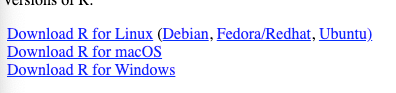
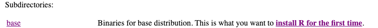
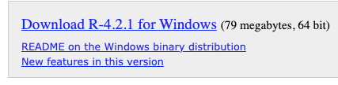
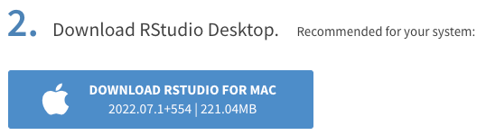

---
output:
  pdf_document: default
---

# How to Install R and R Studio

## Install R

1.  Click [here to go to R homepage](https://cran.r-project.org/)
2.  Choose your operating system.



### For Windows

1.  click on `install R for the first time`

    

2.  click on `Download R-4.2.1 for Windows` and install.

    '

    ### For Mac 

```{=html}
<!-- -->
```
1.  Choose the framework that corresponds to your computer's macOS version and install.

## Install R studio 

1.  [Click here](<https://www.rstudio.com/products/rstudio/download/#download>) to go to the R Studio web page

2.  Download RStudio Desktop that is Recommended for you System. Mine is Mac.

    

3.  Once installed run RStudio. On the left corner click on `File -> New file -> R script`

4.  Copy paste the header below on the empty script and select the entire code (ctrl+A) and click on run. If the code is running and you have an object called `df1` in the environment tab, you are ready to go!

```{=html}
<!-- -->
```
    ###############################################################################
    # list the packages we need and loads them, installs them automatically if we don't have them
    # add any package that you need to the list  
    need <- c('glue', 'dplyr','readxl', 'ggplot2','tidyr','AER','scales','mvtnorm', 
              'stargazer','httr', 'repmis')

    have <- need %in% rownames(installed.packages()) 
    if(any(!have)) install.packages(need[!have]) 
    invisible(lapply(need, library, character.only=T)) 

    # Save the R script to the assignment 1 folder before this
    # To set up the working directory
    getwd()
    setwd(getwd()) #change getwd() here is you need to set a different working directory


    #this clears the workspace
    rm(list = ls()) 
    #this sets the random number generator seed to my birthday for replication

    options(scipen=999)
    ###############################################################################
    #get the data url 
    df1.url <- 'https://www.dropbox.com/s/z8r6hc0r4ytt4f8/birthweight_smoking.xlsx?dl=1'
    #download the data 
    GET(df1.url, write_disk(tdf <- tempfile(fileext = ".xlsx")))
    #check if it worked
    df1 <- read_excel(tdf) %>%
        mutate(birthweight = birthweight + rnorm(length(birthweight)) * 50)


    head(df1)

    #CONDUCT THE ANALYSIS BELOW
